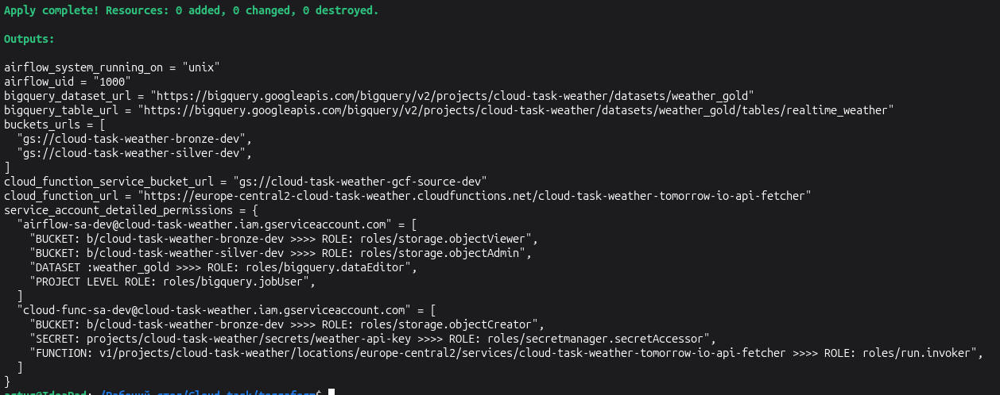
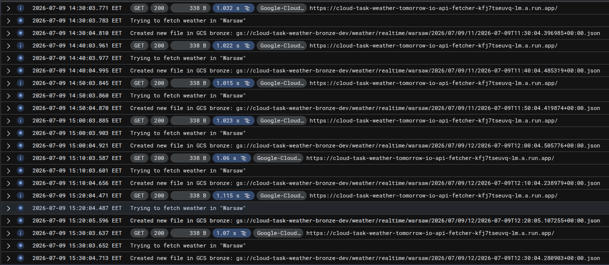
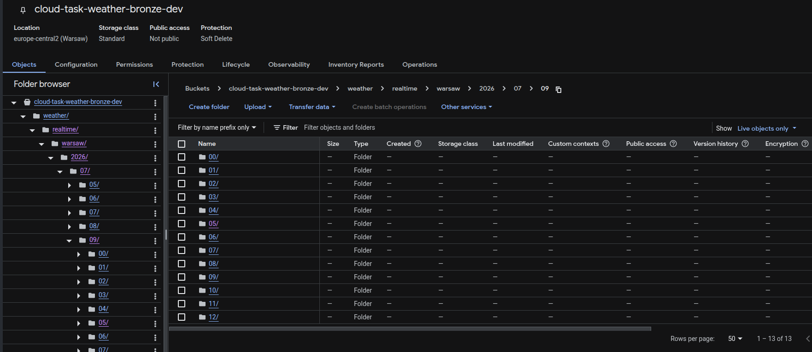
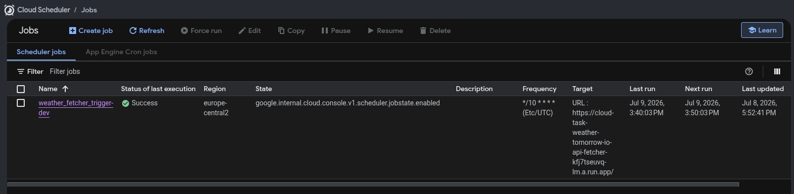
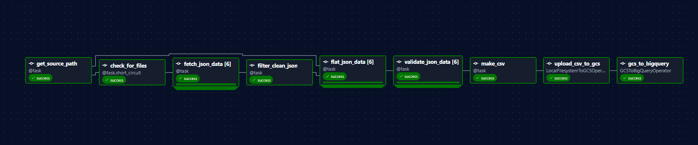
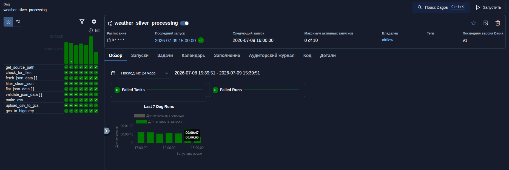
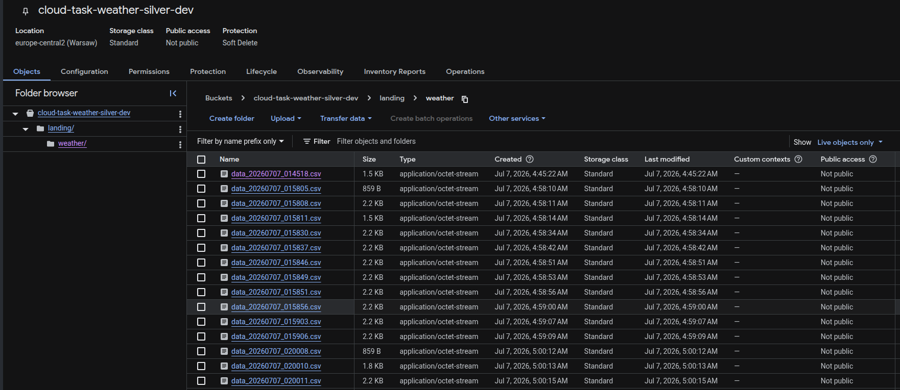
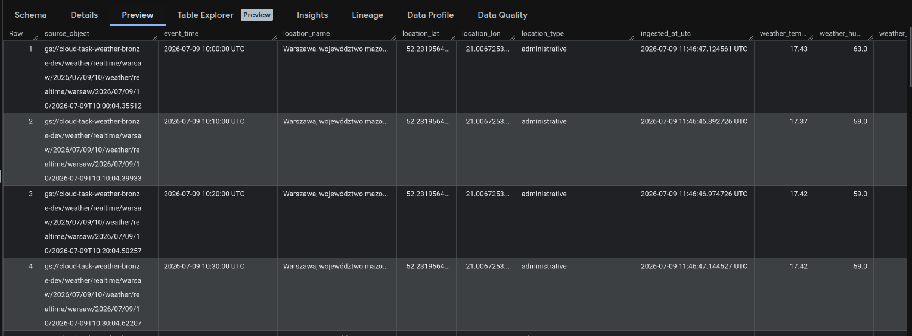

# Cloud Task — Weather Data Pipeline

End-to-end weather data pipeline on GCP: fetches real-time weather from [Tomorrow.io](https://www.tomorrow.io/) API, processes it through a medallion architecture (Bronze → Silver → Gold), and loads results into BigQuery.

## Architecture

```
Tomorrow.io API
       │
       ▼
┌─────────────────┐    ┌──────────────┐    ┌──────────────────┐
│  Cloud Function │───▶│  Bronze GCS  │───▶│   Airflow DAG    │
│  (every 10 min) │    │  (raw JSON)  │    │  (hourly batch)  │
└─────────────────┘    └──────────────┘    └────────┬─────────┘
                                                    │
                                          ┌─────────▼──────────┐
                                          │    Silver GCS      │
                                          │   (CSV reports)    │
                                          └─────────┬──────────┘
                                                    │
                                          ┌─────────▼──────────┐
                                          │      BigQuery      │
                                          │ weather_gold.      │
                                          │ realtime_weather   │
                                          └────────────────────┘
```

**Data flow:**
1. **Cloud Scheduler** triggers the Cloud Function every 10 minutes
2. **Cloud Function** fetches weather data from Tomorrow.io and saves raw JSON to the **Bronze** GCS bucket
3. **Airflow DAG** runs hourly, reads files from Bronze, flattens/validates JSON, creates CSV, uploads to the **Silver** GCS bucket, and loads into **BigQuery**

## Project Structure

```
├── airflow/
│   ├── config/airflow.cfg          # Airflow configuration
│   ├── dags/
│   │   └── weather_silver_processing_dag.py  # Silver processing DAG
│   └── plugins/
│       └── api_validator.py        # Pydantic validators for weather data
├── cloud_funcs/
│   └── weather_fetcher/
│       ├── main.py                 # Cloud Function entry point
│       └── requirements.txt        # Function dependencies
├── core_settings/
│   ├── __init__.py
│   ├── bigquery_schema.json        # Shared BigQuery table schema
│   └── core_settings.py            # Pydantic Settings (env-based config)
├── terraform/
│   ├── bigquery.tf                 # BigQuery dataset & table
│   ├── buckets.tf                  # GCS buckets (bronze, silver, gcf source)
│   ├── env_file.tf                 # Auto-generated .env / .env.terraform
│   ├── functions.tf                # Cloud Function + Scheduler
│   ├── iam.tf                      # Service accounts & IAM bindings
│   ├── locals.tf                   # Resource aliases & platform detection
│   ├── outputs.tf                  # Terraform outputs
│   ├── providers.tf                # Provider versions & GCS backend
│   ├── secrets.tf                  # Secret Manager for API key
│   ├── scripts/uid.sh              # UID detection for Linux/Mac
│   └── variables.tf                # Input variables with validation
├── docker-compose.yaml             # Airflow cluster (CeleryExecutor)
├── pyproject.toml                  # Python dependencies (uv)
└── .gitignore
```

## Prerequisites

- Python >= 3.12
- Docker & Docker Compose
- Terraform >= 1.15
- Google Cloud SDK (`gcloud`)
- A GCP project with billing enabled
- A [Tomorrow.io API key](https://www.tomorrow.io/weather-api/) (32 chars)

## Getting Started

### 1. Provision infrastructure

```bash
cd terraform
cp terraform.tfvars.example terraform.tfvars
# Edit terraform.tfvars: set project_id, tomorrow_api_key, region
terraform init
terraform apply
```

Terraform will:
- Create GCS buckets (`bronze`, `silver`, `gcf-source`)
- Create BigQuery dataset `weather_gold` with `realtime_weather` table
- Deploy the Cloud Function and Cloud Scheduler
- Store the API key in Secret Manager
- Generate `.env` and `.env.terraform` files
- Create a GCP service account key at `terraform/keys/gcp-airflow-key.json`

### 2. Start Airflow

```bash
docker compose up -d
```

The Airflow web UI will be available at [http://localhost:8080](http://localhost:8080) (default credentials: `airflow` / `airflow`).

### 3. Enable the DAG

In the Airflow UI, find `weather_silver_processing` and unpause it. The DAG runs hourly automatically.

**Manual trigger:** Use the DAG params to pass a custom `source_path` for Bronze:
```
weather/realtime/warsaw/2026/01/15/12/
```

## Configuration

All settings are managed via environment variables, loaded from `.env` (Airflow) and `.env.terraform` (secrets) using `pydantic-settings`.

| Variable | Description | Source |
|---|---|---|
| `PROJECT_ID` | GCP project ID | `.env` |
| `AIRFLOW_UID` | Host user ID for file permissions | `.env` |
| `FERNET_KEY` | Airflow Fernet key (auto-generated) | `.env` |
| `TOMORROW_API_KEY` | Tomorrow.io API key | `.env.terraform` |
| `BRONZE_BUCKET_NAME` | Bronze GCS bucket name | `.env.terraform` |
| `SILVER_BUCKET_NAME` | Silver GCS bucket name | `.env.terraform` |
| `BIGQUERY_DATASET` | BigQuery dataset ID | `.env.terraform` |
| `BIGQUERY_TABLE` | BigQuery table ID | `.env.terraform` |

## BigQuery Schema

| Column | Type | Mode |
|---|---|---|
| `source_object` | STRING | REQUIRED |
| `event_time` | TIMESTAMP | REQUIRED |
| `location_name` | STRING | REQUIRED |
| `location_lat` | FLOAT | NULLABLE |
| `location_lon` | FLOAT | NULLABLE |
| `location_type` | STRING | NULLABLE |
| `ingested_at_utc` | TIMESTAMP | REQUIRED |
| `weather_temperature` | FLOAT | NULLABLE |
| `weather_humidity` | FLOAT | NULLABLE |
| `weather_windSpeed` | FLOAT | NULLABLE |
| `weather_cloudCover` | FLOAT | NULLABLE |
| `weather_precipitationProbability` | FLOAT | NULLABLE |

## Airflow DAG: weather_silver_processing

**Schedule:** `@hourly` (no catchup)

**Tasks:**
1. `get_source_path` — resolve Bronze path for the previous hour (scheduled) or custom path (manual)
2. `check_for_files` — list JSON files in Bronze; short-circuits if none found
3. `fetch_json_data` — download and parse each JSON file (mapped)
4. `filter_clean_json` — remove failed downloads
5. `flat_json_data` — extract weather fields into a flat dict
6. `validate_json_data` — validate via Pydantic (temperature, humidity, wind speed ranges)
7. `make_csv` — aggregate validated data, deduplicate, write CSV
8. `upload_csv_to_gcs` — upload CSV to Silver GCS bucket
9. `gcs_to_bigquery` — load CSV into BigQuery with `WRITE_APPEND`

## GCP Resources

| Resource | Name Pattern |
|---|---|
| Bronze bucket | `{project_id}-bronze-{env}` |
| Silver bucket | `{project_id}-silver-{env}` |
| GCF source bucket | `{project_id}-gcf-source-{env}` |
| Cloud Function | `{project_id}-tomorrow-io-api-fetcher` |
| Cloud Scheduler | `weather_fetcher_trigger-{env}` |
| BigQuery dataset | `weather_gold` |
| BigQuery table | `realtime_weather` |
| Secret | `weather-api-key` |
| Service accounts | `airflow-sa-{env}`, `cloud-func-sa-{env}` |

## IAM Permissions

| Service Account | Resource | Role |
|---|---|---|
| `cloud-func-sa` | Bronze bucket | `storage.objectCreator` |
| `cloud-func-sa` | Secret Manager | `secretmanager.secretAccessor` |
| `cloud-func-sa` | Cloud Function | `run.invoker` |
| `airflow-sa` | Bronze bucket | `storage.objectViewer` |
| `airflow-sa` | Silver bucket | `storage.objectAdmin` |
| `airflow-sa` | BigQuery dataset | `bigquery.dataEditor` |
| `airflow-sa` | Project | `bigquery.jobUser` |

## Verification

### Acceptance Criteria

| # | Requirement | Status |
|---|---|---|
| 1 | Terraform deploys infrastructure successfully from a clean state | PASS |
| 2 | Cloud Function is callable and writes JSON files every 10 minutes to the bronze layer | PASS |
| 3 | Airflow DAG processes previous-hour files and writes a silver CSV | PASS |
| 4 | DAG loads processed rows to the BigQuery gold table successfully | PASS |
| 5 | IAM is least-privileged and separated by service | PASS |
| 6 | No secrets committed to the repository | PASS |
| 7 | End-to-end run demonstrated with logs/query result evidence | PASS |

### Evidence

#### Terraform — infrastructure deployed



#### Cloud Function — writes JSON every 10 minutes



#### Bronze GCS — raw JSON files by hour



#### Cloud Scheduler — triggers function every 10 min



#### Airflow DAG — all tasks successful



#### DAG Runs — 0 failed tasks in 24h



#### Silver GCS — CSV reports



#### BigQuery — data loaded to gold table


